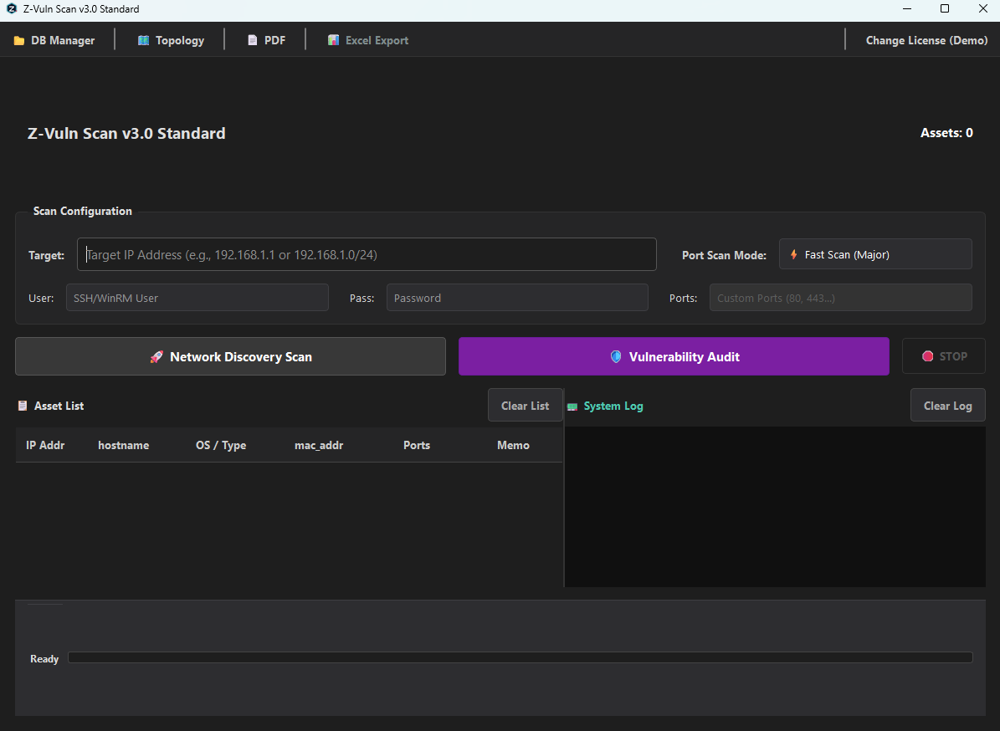
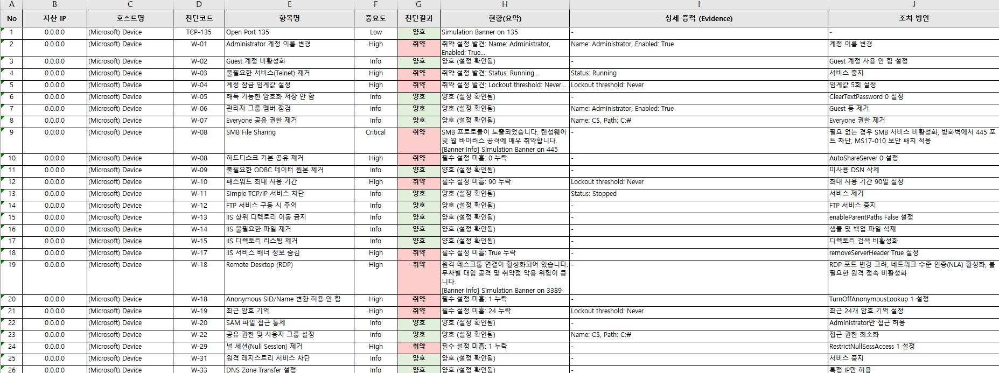
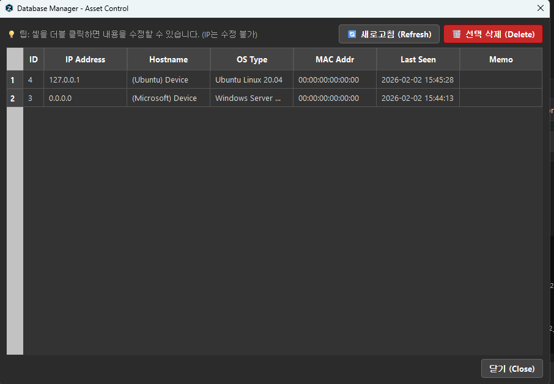

# Z-VulnScan Professional Edition v3.0.0
### 🛡️ Network Asset Discovery & Security Visibility Tool

   

**Z-VulnScan Professional Edition v3.0.0**은 KISA 2026 개정 가이드 기준 Linux/Windows/DBMS(MySQL·PostgreSQL)/Web/PC 진단 항목을 실제 대상에 원격 접속(SSH/WinRM)해 자동 점검하는 도구입니다. Discovery(자산 식별)와 Audit(딥 점검)을 구조적으로 분리해 재점검 시 포트스캔을 다시 돌리지 않으며, 카드형 대시보드·전문가 모드(점검 범위 사전 배제)·Waiver Manager(사후 예외처리)·외부 컨설턴트 결과와의 교차검증 모드까지 감사 실무 워크플로우 전반을 지원합니다.

본 도구는 **침투 테스트 또는 공격 도구가 아니며**, 보안 정책 수립, 교육, 내부 점검, 감사 대응을 위한 **보조 수단**으로 설계되었습니다.

---

## 📑 목차 (Table of Contents)
1. [🔐 법적 고지 및 윤리 규정](#-legal--ethical-notice-중요)
2. [🎯 권장 사용 목적](#-intended-use-권장-사용-목적)
3. [🚀 주요 기능](#-key-features)
4. [✅ 지원 진단 항목 (KISA)](#-supported-audit-list-kisa)
5. [📸 스크린샷](#-screenshots)
6. [🛠 기술 스택](#-technology-stack)
7. [🗓 로드맵](#-roadmap)
8. [📜 라이선스](#-license)

---

## 🔐 Legal & Ethical Notice (중요)

> ⚠ **[경고] 본 프로그램은 반드시 인가된 자산 및 네트워크 환경에서만 사용해야 합니다.**

- 본 도구는 **네트워크 포트 스캔, 서비스 정보 수집, OS 설정 진단 기능**을 포함합니다.
- 사전 허가 없이 제3자의 네트워크 또는 시스템을 스캔하는 행위는 **정보통신망법 등 관련 법률**에 의해 **형사·민사 책임**이 발생할 수 있습니다.
- 사용자는 본 도구 사용에 따른 **모든 법적 책임을 스스로 부담**합니다.
- **실행 절차:** 프로그램 최초 실행 시, 위 사항에 대한 **법적 고지 동의** 과정을 거쳐야만 기능이 활성화됩니다.

---

## 🎯 Intended Use (권장 사용 목적)

**Z-VulnScan Professional**은 다음과 같은 운영 환경에 최적화되어 있습니다.

| ✅ 권장 용도 | ❌ 금지된 용도 |
|---|---|
| • 내부 네트워크 **자산 식별 및 현황 파악** | • 침투 테스트|
| • 서버/서비스 **노출 포트 및 배너 점검** | • 무차별 외부 네트워크 스캔 |
| • 보안 감사 전 **사전 점검** | • 서비스 거부 공격 시뮬레이션 |
| • 보안 교육 및 실습 환경 구축 | • 타인 소유 자산에 대한 비인가 접근 |
| • 점검 결과 **보고서 자동화** | |

---

## 🚀 Key Features

### 1. 📡 Discovery / Audit 구조 분리
- **Discovery:** ICMP Ping + ARP Scan 기반 순수 자산 식별 (포트/OS 캐시를 `TBL_ASSETS`에 저장)
- **Audit:** Discovery 결과를 재사용해 포트스캔 재실행 없이 바로 딥 점검 진입 (재점검 시간 단축)
- **자산목록 가져오기:** CSV(cp949/UTF-8 자동판별)·XLSX로 협의된 대상 목록을 일괄 등록

### 2. 🔍 Port Exposure Scanning
- **Fast / Full / Custom Scan:** Top 100 · 전체(1-65535) · 사용자 정의 범위 지원
- **Scan Mode:** TCP Connect / TCP SYN Scan (*관리자 권한 필요*)
- **OT 안전 모드:** 병렬처리량(1~30) 및 스캔 간격을 수동 제어해 레거시/임베디드 장비 부하 최소화

### 3. 🛡️ 원격 정밀 진단 (SSH / WinRM)
- **Linux 67개 · Windows 64개 · Web 26개 · MySQL/PostgreSQL 17개씩 · PC 18개** — KISA 2026 개정 가이드 기준
- **전문가 모드:** 룰셋 카테고리별 카운트 뱃지를 보며 이번 진단 범위에서 항목을 사전 배제 (점검 명령어/중요도는 수정 불가)
- **Waiver Manager:** 이미 점검된 결과에 대한 사후 예외처리 — 사유·승인자 입력 필수
- **교차검증(Cross-check) 모드:** 외부 컨설턴트가 산출한 결과 파일을 불러와 자체 판정 로직으로 재판정/대조 (DB 미접근, 창 안에서만 표시)
- SSH 호스트 키 TOFU 고정(MITM 탐지), WinRM HTTPS 우선 시도 후 HTTP 폴백

### 4. 📊 Professional Reporting
- **Excel / PDF / TXT:** 자산 목록, 진단 결과, 조치방안을 담은 리포트 자동 생성 (TXT는 대외비 매크로 서식 호환)
- **Excel 리포트 카테고리·호스트별 구조:** 자산평가(용도/부서/담당자 + 기밀성·무결성·가용성 등급) 기반으로 카테고리별 보안수준과 호스트별 상세 시트를 자동 산출 (Z-VulnScan 자체 브랜드 컬러 적용)
- **증적 강화(evidence_command):** 자체 판정 문구("FAIL"/"OK" 등)만 남던 룰에 실제 명령 출력 증적을 추가 수집(판정 로직과 완전 분리, 77개 룰 적용)
- **회차비교(Diff) 리포트:** 재점검 시 코드별 이전 회차 대비 개선/회귀를 자동 계산
- **라이선스 등급별 차등:** STD(PDF만)/PRO(Excel+PDF)/ENT(전문가 모드 포함 전체) 3단계

### 5. 💻 대시보드 & 자산 관리
- **카드형 대시보드:** 요약 지표 카드 + 상태 배지 결과 테이블, 다크/라이트 테마 완전 대응
- **DB Manager:** 자산별 Zone Tag 편집·구역 필터, known_hosts(SSH 호스트 키) 조회/삭제
- **DB 파일 보호:** 실행 중에는 평문, 정상 종료 시 Fernet으로 at-rest 암호화(`utils/db_crypto.py`)

---

## ✅ Supported Audit List (KISA)

> ℹ **[참고]** 아래 항목은 대상 자산에 대한 **SSH/WinRM 인증 정보**가 제공된 경우 정밀 진단됩니다.

### 🐧 Linux Server (Unix 계열) - 67 Items
| 코드 | 항목명 | 주요 점검 내용 |
|:---:|---|---|
| **U-01** | root 원격 접속 제한 | `sshd_config` 내 PermitRootLogin 설정 점검 |
| **U-02** | 비밀번호 관리정책 설정 | `pwquality.conf` 등 암호 정책 설정 점검 |
| **U-35** | 공유 서비스 익명 접근 제한 | 익명 FTP 접속 허용 여부 점검 |
| ... | ... | (U-01 ~ U-67, KISA 2026 개정판 기준) |

### 🪟 Windows Server - 64 Items
| 코드 | 항목명 | 주요 점검 내용 |
|:---:|---|---|
| **W-01** | Administrator 계정 이름 변경 | 기본 관리자 계정명 변경 여부 |
| **W-17** | 하드디스크 기본 공유 제거 | `net share` 실측 + `AutoShareServer`/`AutoShareWks` 레지스트리 |
| **W-38** | 최신 보안 패치 적용 | Windows 보안 업데이트 적용 상태 점검 |
| ... | ... | (W-01 ~ W-64, KISA 2026 개정판 기준) |

### 🌐 Web / WAS - 26 Items
Apache · Nginx · Tomcat · JEUS · WebtoB 대상 (`WEB-01` ~ `WEB-26`)

### 🗄️ DBMS - MySQL 17 / PostgreSQL 17 Items
계정 관리, 접근 통제, 감사 로그 설정 등 (`D-xx` 코드 체계)

### 🖥️ PC - 18 Items
개인 업무용 단말 대상 별도 룰셋 (`PC-01` ~ `PC-18`)

---

## 📸 Screenshots

> ⚠ **[주의]** 아래 이미지는 Phase 3 사이드바/카드형 대시보드 재구성 **이전**의 구버전 UI입니다(자산 태그, Zone Tag, known_hosts 관리 등 이후 추가 기능 미반영). 실제 앱을 실행해 새 스크린샷으로 교체가 필요합니다.

| **Main Dashboard & Context Menu** | **Security Warning** |
|:---:|:---:|
|  |  |
| **PDF Report (Remediation Included)** | **Excel Report** |
|  |  |
| **DB Manager (Zone Tag / known_hosts)** | |
|  | |

---

## 🛠 Technology Stack

- **Language:** Python 3.13+
- **GUI Framework:** PySide6
- **Remote Inspection:** Paramiko (SSH), pywinrm (WinRM)
- **Network Engine:** Python Native Socket (`socket`, `struct` Lib only)
- **Reporting Engine:** ReportLab (PDF), OpenPyXL (Excel)
- **Database:** SQLite (+ Fernet at-rest 암호화)

---

## 🗓 Roadmap

### ✅ v3.0.0 (Current - Professional Edition)
- [x] **Discovery/Audit 구조 분리:** 재점검 시 포트스캔 재실행 없이 캐시된 자산 정보로 바로 딥 점검
- [x] **감사 신뢰성 강화:** 스캔 이력 회차 누적 보존, Waiver Manager(사유/승인자 필수), 운영자 태깅
- [x] **UI 리마스터:** 아이콘 사이드바 + 카드형 대시보드, 전문가 모드 2단 레이아웃, 다크/라이트 테마 완전 대응
- [x] **라이선스 등급 차등:** STD/PRO/ENT 3단계 (증적/조치방안/Excel 가능여부/전문가 모드 차등)
- [x] **자산 태그/그룹 관리:** Zone Tag + DB Manager 구역별 필터, known_hosts(SSH TOFU) 관리 UI
- [x] **회차비교(Diff) 리포트:** 코드 단위로 직전 회차 대비 개선/회귀 자동 계산
- [x] **DB 파일 at-rest 암호화:** 정상 종료 시 Fernet 암호화, 시작 시 복호화(키는 OS 자격증명 관리자 보관)
- [x] **교차검증 모드:** 외부 컨설턴트 결과 파일과 자체 판정 로직 대조
- [x] **판정 정확도 개선(2026-07):** 명령 실행 실패=MANUAL 구분, KISA 참고 스크립트 대조를 통한 개별 룰 오판정 다수 수정(실 VM 검증 완료)
- [x] **증적 강화(2026-07):** 판정 로직과 분리된 `evidence_command` 메커니즘으로 근거 부족 룰 77개의 리포트 증적 보강, SAFE 항목도 실제 근거 텍스트 표기
- [x] **Excel 리포트 재설계(2026-07):** 컨설턴트 산출물 구조를 참고한 카테고리·호스트별 시트 + 자산평가(C/I/A) 기반 보안수준 산정
- [x] **Discovery 정밀 점검(2026-07):** 포트/배너 수집 버그 5건 수정(소켓 크래시 가능성, 증적 문구 부정확, OS별 에러코드 이식성, 멀티서브넷 정렬, 가상호스트 배너 오수집)
- [x] **제거:** 정보량 대비 실효성이 낮았던 Interactive Topology Map 기능 제거 (스타형 배치만 가능한 구조적 한계)

### 🔮 Future (Enterprise 상용화 대비)
- [x] **라이선스 발급/회수 체계:** CLI 기반 키 발급·취소 대장 (실시간 원격 회수는 서버 인프라 필요 — 보류)
- [x] **버전 업데이트 확인 경로:** 개발 완료, 실제 배포 URL 확정 전까지 기본 비활성
- [ ] **Headless Mode:** CLI 지원을 통한 스케줄러 연동 및 자동화
- [ ] **SIEM Integration:** Syslog/CEF 포맷 로그 전송 기능
- [ ] **Centralized DB:** 로컬 SQLite를 넘어 MySQL/PostgreSQL 중앙 저장소 연동
- [ ] **코드사이닝:** Authenticode 인증서 구매 필요(협의 진행 중), 코드 작업 범위 아님

---

## 📜 License

**Proprietary License**

Copyright © 2026 **Z-VulnScan Team**. All Rights Reserved.

본 소프트웨어는 **상용/비공개 소프트웨어**입니다. 저작권자의 사전 서면 허가 없이 본 소프트웨어의 전부 또는 일부를 무단으로 복제, 배포, 수정, 역공학(Reverse Engineering)하는 행위는 엄격히 금지됩니다.
