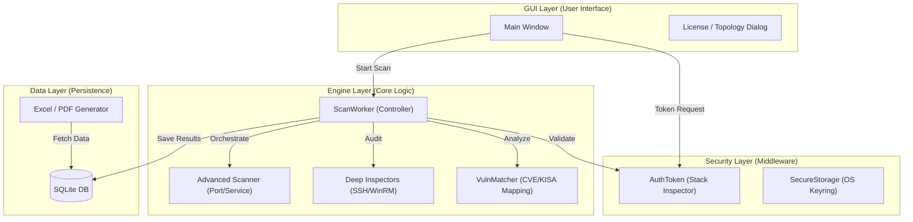
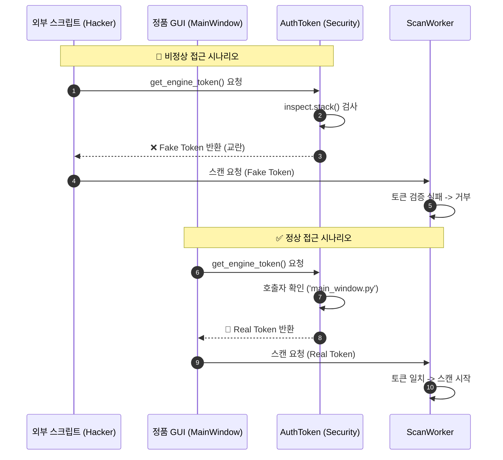
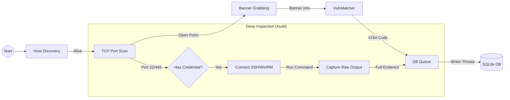
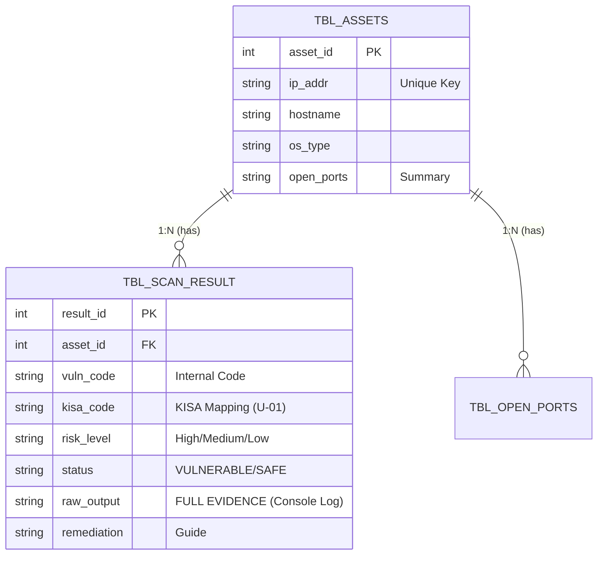
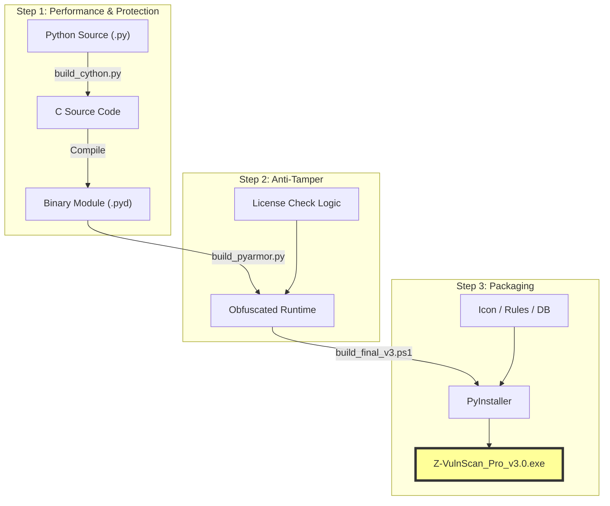

# 📘 Z-VulnScan Pro v3.0 기술 명세서 (Technical Specification)

- **Version:** v3.0.0 (Gold Master)  
- **Status:** Code Freeze / Ready for Deployment  
- **Architecture:** Hybrid Build (Python + Cython + PyArmor)

---

## 1. 시스템 아키텍처 (System Architecture)

본 프로젝트는 MVC 패턴을 변형하여, 철저하게 분리된 **3계층 구조(3-Tier Architecture)**를 따른다.

### 1.1 Layer 구성

- **GUI Layer:** 사용자와 상호작용 (PySide6)
- **Engine Layer:** 실제 해킹/스캔 수행 (Cython 컴파일)
- **Data Layer:** 데이터 저장 및 입출력 (SQLite WAL 모드)

### 1.2 Architecture Diagram

## 2. 보안 인증 메커니즘 (Security & Integrity)

### 외부 스크립트가 엔진을 무단 호출하는 것을 방지하기 위해 Call Stack Inspection 기술을 적용한다.

### 2.1 인증 시퀀스 다이어그램

## 3. 스캔 파이프라인 (Scanning Pipeline)

### Evidence First (증적 우선) 원칙에 따라, 모든 스캔 단계에서 발생한 데이터는 소실되지 않고 DB로 저장된다.

### 3.1 Pipeline Flow

## 4. 데이터 저장 구조 (Database Schema)

###  증적(Evidence) 저장을 위해 최적화된 테이블 구조를 사용한다.

### 4.1 ER Diagram

## 5. 하이브리드 빌드 프로세스 (Build Process)

### 보안성과 성능을 동시에 확보하기 위해 3단계 빌드 시스템을 적용한다.
### 5.1 Build Pipeline

## 6. 기능 명세 요약 (Feature Summary)

| 모듈명          | 주요 기능                               | 비고               |
| ------------ | ----------------------------------- | ---------------- |
| Core Engine  | Discovery, TCP/UDP Scan, Deep Audit | raw_output 증적 수집 |
| Inspectors   | SSH(Linux), WinRM(Windows) 진단       | 명령어 실행 결과 전체 반환  |
| VulnMatcher  | 포트/배너 기반 취약점 매핑                     | KISA 코드 자동 동기화   |
| DB Connector | SQLite WAL 모드, 스키마 관리               | 마이그레이션 자동화       |
| Reporter     | Excel(증적 포함), PDF(요약) 생성            | 32k 글자 제한 방어 로직  |

---
**Generated by Z-VulnScan Architecture Team**