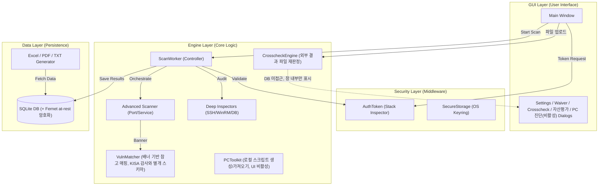
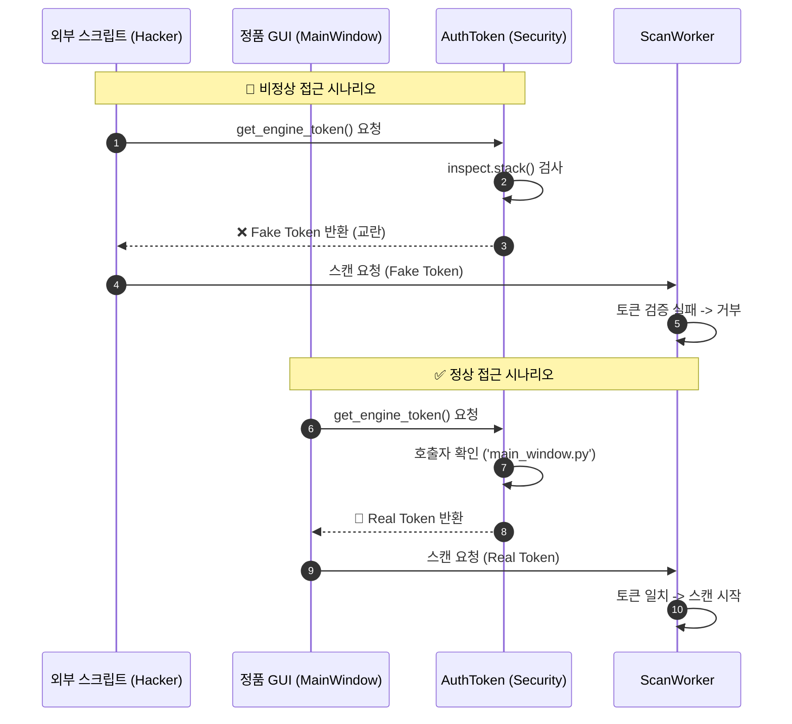
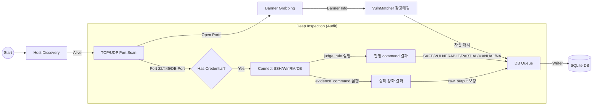
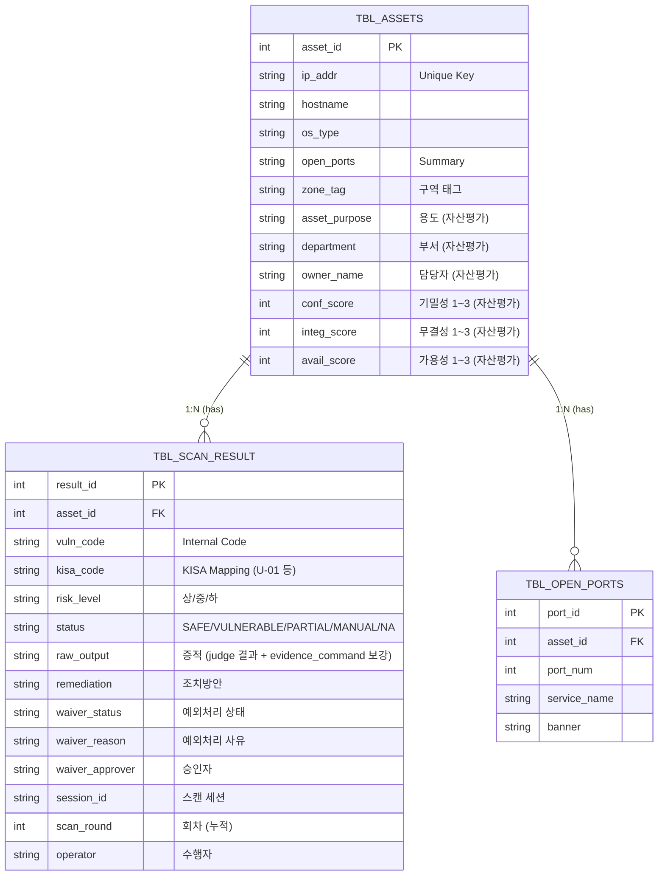
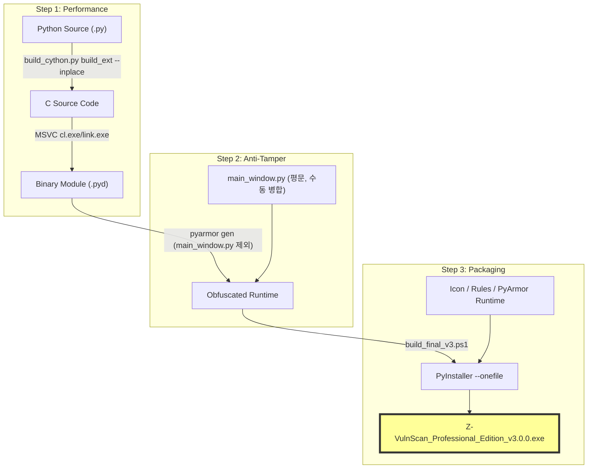

# 📘 Z-VulnScan Professional Edition 기술/기능 명세서 (Technical & Feature Specification)

- **Version:** v3.0.0
- **Architecture:** Hybrid Build (Python + Cython + PyArmor + PyInstaller)
- **최종 갱신:** 2026-07-29
- **문서 통합 안내:** 이 문서는 기존 `기술 명세서.md`(아키텍처)와 `Z-Vuln_Scan_기능명세서.md`(기능 상태표)를 하나로 합친 것입니다. 두 문서가 각자 다른 시점에 갱신되며 항목 수·최종 갱신일·기능 목록이 서로 어긋나는 문제(파편화)가 있어 통합했습니다.
- **상태 표기 기준:** ✅ 완료(실장착·검증됨) / 🟡 코드는 존재하지만 기본 비활성 / 🔧 부분 구현(한계 있음) / ⛔ 코드 범위 밖(구매·협의 필요)

---

## 1. 시스템 아키텍처 (System Architecture)

본 프로젝트는 철저하게 분리된 **3계층 구조(3-Tier Architecture)**를 따른다.

- **GUI Layer:** 사용자와 상호작용 (PySide6)
- **Engine Layer:** 스캔/진단/재판정 수행 (Cython 컴파일 대상)
- **Data Layer:** 데이터 저장 및 리포트 출력 (SQLite)

### 1.1 Architecture Diagram

> **참고 — VulnMatcher 관련 정정:** 예전 로그에 "(N files merged)"처럼 KISA 감사 결과와 병합된 것처럼 보이는 문구가 있었으나, 실제로는 `vuln_matcher.py`가 포트/배너 기반으로 참고용 보안정보를 매핑하는 **완전히 별개의 스키마**(포트 키 기반)이며 KISA 감사 스키마(코드 기반)와 병합되지 않는다. 로그 문구는 정직하게 수정됨.

---

## 2. 보안 인증 메커니즘 (Security & Integrity)

외부 스크립트가 엔진을 무단 호출하는 것을 방지하기 위해 **Call Stack Inspection** 기술을 적용한다.

### 2.1 인증 시퀀스 다이어그램

---

## 3. 스캔 파이프라인 (Scanning Pipeline)

**Evidence First(증적 우선)** 원칙에 따라, 모든 스캔 단계에서 발생한 데이터는 소실되지 않고 DB로 저장된다. 판정에 쓰이는 `command`의 출력과, 리포트 증적을 강화하는 `evidence_command`(§6-3 참고)의 출력은 서로 완전히 분리되어 있어 증적 보강이 판정 로직을 오염시키지 않는다.

### 3.1 라이브 스캔 흐름

### 3.2 오프라인 교차검증(Cross-check) 경로

Discovery/Audit와 별도로, 외부 컨설턴트가 만든 결과 TXT/엑셀 파일을 업로드하면 **DB에 저장하지 않고** 창 안에서만 자체 룰셋(`judge_rule`, `execute_fn=None`)으로 재판정해 대조한다. 세부기준(criteria)이 여러 개인 룰은 TXT 원문에서 항목별로 분리된 근거를 찾아 개별 판정하는 정밀 판정을 지원한다(`crosscheck_parser.py`).

---

## 4. 데이터 저장 구조 (Database Schema)

증적(Evidence) 저장 및 이력 누적을 위해 최적화된 테이블 구조를 사용한다. `save_result()`는 삭제 후 삽입이 아니라 코드 단위로 `scan_round`를 증가시키며 누적하고, 리포트/통계는 최신 회차만 조회한다.

### 4.1 ER Diagram

---

## 5. 하이브리드 빌드 프로세스 (Build Process)

보안성과 성능을 동시에 확보하기 위해 3단계 빌드 시스템을 적용한다. **하이브리드 빌드만 사용하며, 순수 PyInstaller 빌드(`builing.ps1`)는 금지**한다.

### 5.1 Build Pipeline

- `main_window.py`는 PyArmor 무료(trial) 라이선스가 "Can't obfuscate big script" 오류를 내기 때문에 매번 난독화 대상에서 제외하고, 평문 그대로 obfuscated 폴더에 수동 복사한다.
- 빌드 작업은 `Z-VulnScan_Build_Work/`(별도 작업 사본, git-ignore)에서 수행하며, 매 빌드 전 메인 저장소 소스로 robocopy 재동기화한다.
- 상세 절차·환경 이슈(MSVC 경로, SDK include 누락 등)는 세션 메모리에 기록되어 있다.

---

## 6. 기능 명세 (Feature Specification)

### 6-1. 자산 탐지 (Discovery)

| 기능 | 설명 | 상태 |
|---|---|---|
| 생존 호스트 확인 | TCP(445/22/80/135) connect + `errno.ECONNREFUSED` 기반 이식성 있는 생존 판정 | ✅ |
| 포트 스캔 | Fast(주요 포트) / Custom(직접 지정) / Full(1~65535) 3가지 모드, 호스트 단위 병렬(스레드풀) | ✅ |
| OS/서비스 배너 식별 | TTL 및 배너 분석 기반 OS 추정, 포트별 서비스 식별. HTTP 배너 수집 시 실제 대상 IP를 `Host` 헤더에 동적으로 반영(가상호스트 서버 정확도 개선) | ✅ |
| MAC 벤더 조회 | OUI 데이터베이스 기반 제조사 식별 | ✅ |
| UDP 스캔 | UDP 포트 개방 여부 확인 | ✅ |
| OT/저속 모드 | 동시 스캔 대상 수 축소 + 응답 지연 시 자동 딜레이 증가(적응형 스로틀링) | ✅ |
| 자산목록 가져오기 (CSV/Excel) | 고객사 제공 정보자산목록에서 IP 자동 추출, 목록 외 IP는 스캔 후보에서 원천 배제 | ✅ |
| 계정정보 무관 순수 탐지 | Discovery 단계에서는 계정이 입력돼 있어도 로그인 시도 자체를 하지 않음 | ✅ |
| 멀티서브넷 정렬 | 여러 서브넷이 섞인 대역 스캔 시 IP를 4옥텟 전체 기준으로 정렬(과거 마지막 옥텟만 비교하던 버그 수정) | ✅ |
| INFO-00 생존 근거 표기 | "호스트 생존" 리포트 항목이 실제 판정 근거(TCP 응답/ICMP 등)를 정확히 표기(과거 하드코딩된 문구 수정) | ✅ |

### 6-2. 정밀 진단 (Audit) — KISA 룰셋 기반

| 기능 | 설명 | 상태 |
|---|---|---|
| SSH(Linux/Unix) 진단 | Paramiko 기반, U-01~U-67 | ✅ |
| WinRM(Windows Server/PC) 진단 | HTTPS(5986) 우선 접속 + HTTP(5985) 폴백, W-01~W-64, PC-01~18(자동 재분류) | ✅ |
| DBMS 진단 (MySQL/PostgreSQL) | D-xx, 엔진별 쿼리 자동 분기 | ✅ |
| 웹서비스 진단 (Apache/Nginx) | SSH 접속 가능한 Linux 대상, WEB-xx | ✅ |
| 판정 로직 | 취약/양호/부분만족/해당없음/수동확인/점검불가 6단계 | ✅ |
| 캐시 재사용 | 이전 Discovery 결과(OS/포트) 재사용, 포트스캔 재실행 없이 바로 Audit 진입 | ✅ |
| 접속 실패 정직 기록 | 인증/네트워크 실패 시 "안전"으로 위장하지 않고 "점검불가"로 명시 | ✅ |
| DB 전용 계정 | SSH/WinRM 계정과 DB 계정이 다를 경우 별도 입력(체크박스, 기본 숨김) | ✅ |
| sudo 자동 승격 | find 기반 전체탐색 룰(U-15/23/25)에서 `sudo -n` 우선 시도 후 안전 폴백 | ✅ |
| 데모 모드 | 접속 실패/데모 IP에서만 가상 데이터 사용, 기본값 항상 OFF | ✅ |
| **evidence_command 증적 강화** | 판정에 쓰는 `command`와 완전히 분리된 선택적 필드. 룰에 존재하면 추가로 실행해 그 결과를 리포트용 `raw_output`으로 저장 — "FAIL"/"OK" 같은 자체 판정 문구만 찍히던 근거 부족 룰의 증적을 실제 명령 출력으로 보강. Linux 32 / Windows 19 / Web 14 / PC 12, 총 77개 룰 적용. 판정 로직 자체는 절대 건드리지 않음 | ✅ |
| SAFE 항목 증적 보강 | 양호로 판정된 항목도 "양호 (점검 완료)" 같은 무의미한 문구 대신 실제 근거 스니펫을 detail에 표기 | ✅ |

### 6-3. 교차검증(Cross-check) 모드

| 기능 | 설명 | 상태 |
|---|---|---|
| 외부 결과 파일 파싱 | 컨설턴트 산출 TXT(Windows PC/Server, Linux, Web 등 포맷별) 파싱 | ✅ |
| 세부기준(criteria) 정밀 판정 | criteria가 여러 개인 룰도 TXT 내 항목별 근거를 분리 인식해 개별 판정 | ✅ |
| DB 미접근 | 대조 결과는 화면에만 표시되고 `TBL_SCAN_RESULT`에는 저장되지 않음(라이브 스캔과 명확히 분리) | ✅ |

### 6-4. PC 진단 (2가지 경로 — 혼동 주의)

| 경로 | 설명 | 상태 |
|---|---|---|
| WinRM 기반 PC 진단 | Windows PC를 WinRM으로 원격 접속해 PC-01~18 룰 자동 재분류 진단(정밀 진단 파이프라인의 일부) | ✅ (라이브) |
| 로컬 스크립트 도구 | WinRM이 막힌 PC 대상, `.bat` 스크립트를 생성해 로컬에서 실행 후 결과를 가져오는 별도 도구(`core/pc_toolkit.py` + `gui/pc_toolkit_dialog.py`) | 🟡 코드 존재, 사이드바 진입점 비활성 |

> 로컬 스크립트 도구는 2026-07-22 개발 완료됐으나, 컨설턴트가 실제 납품하는 PC 엑셀 산출물과의 서식 호환성을 근본적으로 맞출 수 없다는 판단에 따라 **삭제하지 않고 사이드바 버튼만 숨김** 처리했다(`main_window.py`의 `nav_pc_toolkit.setVisible(False)`). 재활성화는 코드 변경 없이 가능.

### 6-5. 보안 강화 (SSH/WinRM 접속 보안)

| 기능 | 설명 | 상태 |
|---|---|---|
| SSH 호스트 키 TOFU 고정 | 최초 접속 시 호스트 키 저장, 이후 키가 바뀌면 자동 거부(MITM/재설치 탐지) | ✅ |
| known_hosts 관리 UI | Settings에서 등록된 호스트 키 조회/개별 삭제/전체 초기화 | ✅ |
| WinRM HTTPS 우선 접속 | 5986(HTTPS) 우선 시도, 실패 시 5985(HTTP) 폴백 | ✅ |
| 자격증명 안전 저장 | OS 자격증명 관리자(Windows Credential Manager) 연동, 평문 저장 없음 | ✅ |
| 명령어 인젝션 방지 | 스캔 대상 문자열 안전성 검증(`OSUtils.is_safe_host`), subprocess는 항상 list 인자 + `shell=True` 미사용 | ✅ |
| sudo 비밀번호 노출 방지 | `sudo -n` 방식만 사용(비밀번호를 stdin/명령줄로 넘기지 않음) | ✅ |

### 6-6. 데이터 보호

| 기능 | 설명 | 상태 |
|---|---|---|
| DB 파일 접근통제(암호화) | 앱 종료 시 SQLite 파일을 Fernet으로 암호화(at rest), 키는 OS 자격증명 관리자 보관, 최초 생성 시 복구 키 백업 파일 안내 | ✅ |
| 스캔 이력 보존 | 자산+코드 단위 회차(scan_round) 누적, 삭제 없이 이력 전체 보관, 리포트는 항상 최신 회차만 표시 | ✅ |
| DB 초기화 전 확인 | 리포트 미출력 상태에서 자산 초기화 시 경고 팝업 | ✅ |

### 6-7. 예외처리(Waiver) 및 커스터마이즈

| 기능 | 설명 | 상태 |
|---|---|---|
| Waiver 관리 | 사유/승인자 필수 입력, 감사 추적성 확보, 언제든 해제 가능 | ✅ |
| 전문가 모드 | 룰 카테고리/개별 코드 단위로 이번 진단 범위 사전 배제(점검 명령어·중요도는 읽기 전용) | ✅ |
| 전문가 모드 등급 제한 | Enterprise 등급 전용 기능으로 게이트 | ✅ |
| 자산 태그/그룹 관리 | 구역별(DMZ, 제어망 A 등) 태그 분류 및 DB Manager 내 필터 | ✅ |
| 운영자 태깅 | 회차별로 어떤 운영자가 수행한 스캔인지 기록 | ✅ |
| **자산평가 (신규)** | 자산별 용도/부서/담당자 + 기밀성·무결성·가용성(C/I/A, 1~3점) 입력 다이얼로그. C/I/A 합산으로 등급(상/중/하)을 실시간 계산해 Excel 리포트의 카테고리별 보안수준 산정 근거로 사용 | ✅ |

### 6-8. 리포트 출력

| 기능 | 설명 | 상태 |
|---|---|---|
| **Excel 리포트 (재설계)** | 컨설턴트 산출물 구조를 참고해 카테고리(UNIX/WINDOWS/웹서비스/DBMS)별 요약통계+보안수준통계 시트, 호스트별 상세 시트로 재구성. 색상은 컨설턴트 서식을 그대로 베끼지 않고 Z-VulnScan 자체 브랜드 팔레트 사용. 보안수준 = (전체점수-취약점수)/전체점수, 자산평가(C/I/A→등급→중요도값)가 점수 산정 근거 | ✅ |
| PDF 리포트 | 경영진 보고용 요약(KPI 박스, 자산별 상세 테이블) | ✅ |
| TXT 리포트 | 호스트별 개별 파일, 고객사 매크로(ProcessSecurityLogs) 호환 포맷 | ✅ |
| Diff 리포트(회차 비교) | 자산별 직전 회차 대비 점수 변화/개선율, 2회 이상 스캔된 자산이 있을 때만 자동 생성 | ✅ |
| hostname 실제값 반영 | Audit 시 실제 hostname을 파싱해 DB 갱신, Excel/PDF/TXT 전부 정확한 값 표시 | ✅ |
| 리포트 등급별 차등 | 증적/조치방안 노출 범위가 라이선스 등급에 따라 달라짐(§6-9 참고). 카테고리·호스트별 시트에도 동일하게 적용 | ✅ |

### 6-9. UI/UX

| 기능 | 설명 | 상태 |
|---|---|---|
| 카드형 대시보드 | Scan configuration 카드, 요약 지표 카드 4종, 상태 배지 결과 테이블 | ✅ |
| 다크/라이트 테마 | 대시보드 카드 포함 전체 화면 테마 적용(재시작 후 반영) | ✅ |
| 좌측 아이콘 사이드바 | Dashboard/Scan/Assets/Reports + Help/Settings (PC 진단 버튼은 숨김 상태) | ✅ |
| Settings(사이드바+상세화면 구조) | 로그·이력 / 테마 / 리포트출력 / 룰셋·전문가 / 계정 / 호스트키 / 라이선스 7개 화면 | ✅ |
| DB Manager | 자산 조회/수정(호스트명/OS/MAC/메모/구역태그)/삭제, 구역별 필터 | ✅ |
| 자산평가 다이얼로그 | Assets 탭에서 DB Manager 옆 버튼으로 진입, C/I/A 입력 시 등급 실시간 갱신 | ✅ |
| 도움말 페이지 | 카테고리별 비전공자 대상 상세 설명(전체 10개 카테고리) | ✅ |
| 로그 콘솔 | 하단 도킹 패널, 기본 숨김 | ✅ |
| 병렬처리량 수동 제어 | 동시 스캔 대상 수 슬라이더(1~30) | ✅ |

### 6-10. 라이선스 시스템

| 기능 | 설명 | 상태 |
|---|---|---|
| 등급 체계 | Standard/Professional/Enterprise 3단계 | ✅ |
| 등급별 차등 | PDF전용/Excel포함 여부, 증적 범위, 조치방안 범위, 전문가모드 여부 | ✅ |
| 키 발급/검증 | `ZV3-TIER-EXPIRY_TOKEN-RANDOM-CHECKSUM` 형식, salt 기반 위변조 방지 + 만료일 난독화(평문 노출 없음) | ✅ |
| 발급 대장 | 발급자용 로컬 이력(`issued_licenses.json`) | ✅ |
| 키 취소(revoke) | 로컬 취소 목록 기반(재빌드 시 적용, 실시간 원격 회수 아님) | 🔧 |
| 라이선스 정보 화면 | 현재 등급/사용가능기간/현재 등급 기능 요약, 입력·삭제(수정 없음) | ✅ |
| 기본값 | 키 미등록 시 Enterprise로 동작(스위치가 아닌 설계상 기본값) | ✅ |

### 6-11. 상용화 인프라 (일부 보류)

| 기능 | 설명 | 상태 |
|---|---|---|
| 버전 업데이트 확인 | GitHub Releases(public 저장소 `rorena15/Z-V_Scan`) `releases/latest` API를 앱 시작 시 조회, 태그 버전이 `VERSION`보다 높으면 알림 후 "다운로드 페이지 열기" 버튼으로 이동. 아직 발행된 릴리즈가 없어(404) 현재는 항상 조용히 통과함 | ✅ (릴리즈 발행 대기) |
| KISA 룰셋 버전 관리 | `rules/ruleset_manifest.json` + Settings 표시, 개정 시 수동 갱신 프로세스 | ✅ |
| 코드사이닝 | Authenticode 인증서 구매·사업자 인증 필요 — 코드 작업 범위 밖 | ⛔ |
| 하이브리드 빌드 보안 | Cython 컴파일 + PyArmor 난독화 단일 실행파일(PyInstaller) | ✅ |

---

## 7. 룰셋 커버리지

| 룰셋 파일 | 대상 | 항목 수 | 최종 갱신 | 라이브 스캔 연결 |
|---|---|---:|---|:---:|
| `linux_rules.json` | Unix/Linux 서버 (U-xx) | 67 | 2026-07-16 | ✅ |
| `windows_rules.json` | Windows 서버 (W-xx) | 64 | 2026-07-15 | ✅ |
| `pc_rules.json` | 업무용 PC (PC-xx) | 18 | 2026-07-15 | ✅ (WinRM 경로) |
| `web_rules.json` | 웹서비스(Apache/Nginx) (WEB-xx) | 26 | 2026-07-22 | ✅ |
| `mysql_rules.json` | MySQL (D-xx) | 17 | 2026-07-14 | ✅ |
| `postgresql_rules.json` | PostgreSQL (D-xx) | 17 | 2026-07-14 | ✅ |
| `oracle_rules.json` | Oracle (D-xx) | 22 | 2026-07-22 | ⛔ 룰셋만 준비, DB 커넥션 분기/`RULE_FILES` 미등록 |
| `mssql_rules.json` | MSSQL (D-xx) | 21 | 2026-07-22 | ⛔ 룰셋만 준비, DB 커넥션 분기/`RULE_FILES` 미등록 |
| **합계 (라이브)** | | **209** | | |

각 룰은 `code`/`name`/`category`/`importance`/`command`(또는 `criteria` 다중조건)/`vulnerable_keyword` 또는 `safe_keyword`/`description`/`remediation` 필드로 구성. 일부 룰에는 `privileged: true`(SSH `sudo -n` 에스컬레이션 대상), 일부에는 `evidence_command`(§6-2)가 붙어 있다.

---

## 8. 알려진 이슈 및 해결 이력

### 8.1 해결됨

- **U-01(root 원격 접속 제한) 판정 로직 오류** — 세부기준 미설정 시 무조건 "양호"로 단정하던 로직을 "명시적으로 안전값이 확인된 경우에만 양호"로 뒤집음. 컨설턴트 스크립트와 판정 방향 일치 확인. 배경/근본원인 상세는 `rules/HANDOVER_U-01_판정로직_검토.md` 참고(현재 `linux_rules.json`에 반영 완료된 과거 결정 기록).
- **Discovery/포트/배너 수집 버그 5건** (2026-07 정밀 검수): `grab_banner()` 소켓 미초기화 크래시 가능성, INFO-00 증적 문구 하드코딩, Windows 전용 에러코드(10061) 하드코딩 → `errno.ECONNREFUSED`, 멀티서브넷 IP 정렬 버그, HTTP 배너 수집 시 `Host: 127.0.0.1` 하드코딩(가상호스트 배너 오수집).
- **vuln_matcher.py 로그 오해 소지** — "(N files merged)" 문구가 실제로는 KISA 감사 결과와 병합되지 않는데도 병합된 것처럼 보였던 문제. 정직한 로그로 수정.
- **help_dialog.py 라이선스 비교표 렌더링** — 다중 공백 정렬이 깨지던 문제 수정.

### 8.2 미해결 / 추가 검토 필요

- **`vulnerable_keyword` 단일조건 룰 72개의 이론적 리스크** — U-01과 유사하게, 명령 실행 자체가 실패해 출력이 비어도 `vulnerable_keyword`가 안 보이면 SAFE로 판정될 수 있는 구조. U-01처럼 명확한 재현 사례는 아직 없으나 규모가 커서(72개) 별도 전수 검토 필요.
- **포트 스캔의 포트 단위 병렬성 부재** — 호스트 단위 병렬성(`ThreadPoolExecutor`, discovery.py/worker.py 2곳)은 있으나, 한 호스트 내 `tcp_scan()` 포트 루프 자체는 순차 실행. 대용량 커스텀 포트 범위 + 필터링된(응답 없는) 대상 조합에서 스캔 시간이 길어질 수 있음 — 성능 개선 여지가 있으나 복잡도 트레이드오프로 아직 결정 보류.
- **죽은 코드 추정** — `utils/network_visualizer.py`, `reports/network_topology.html`, `lib/vis-9.1.2`, `lib/tom-select` (Phase 3에서 제거된 토폴로지 맵 기능의 잔재로 추정, 실제 import 여부 재확인 후 정리 대상).
- **`library.py`의 `PyQt5` 의존성 표기** — 실제 코드베이스는 PySide6 사용, 목록 최신화 필요.
- **`web_dashboard/`** — WebContent/src 빈 스캐폴드, 용도 불명(미착수 사이드 프로젝트로 추정).

---

*이 문서는 실제 소스코드 확인을 거쳐 작성됐으나, 세부 수치(항목 수/갱신일 등)는 시점에 따라 달라질 수 있습니다. 코드와 어긋나는 부분을 발견하면 이 문서를 최신 상태로 갱신해 주세요.*
